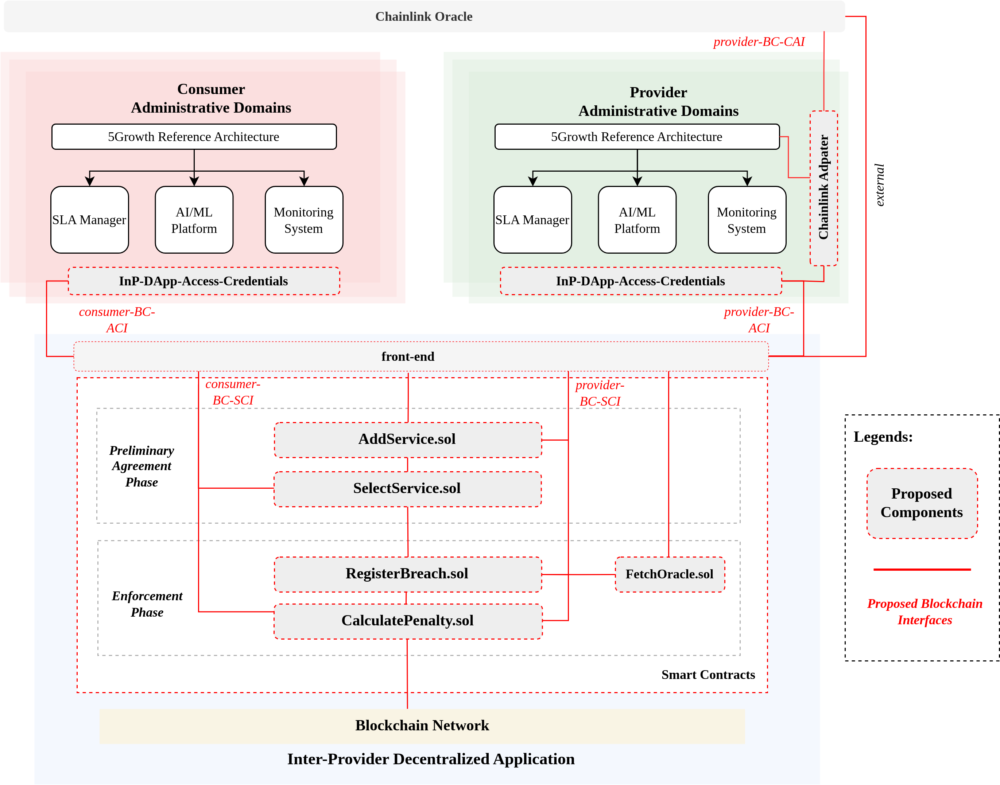

# An Empirical Smart Contracts Latency Analysis on Ethereum Blockchain for Trustworthy Inter-Provider Agreements

## Abstract

As 6G networks evolve, *inter-provider agreements* become crucial for dynamic resource sharing and network slicing across multiple domains, requiring on-demand capacity provisioning while enabling trustworthy interaction among diverse operators. To address these challenges, we propose a blockchain-based Decentralized Application (DApp) on Ethereum that introduces four smart contracts—organized into a *Preliminary Agreement Phase* and an *Enforcement Phase*—and measures their gas usage, thereby establishing an open marketplace where service providers can list, lease, and enforce resource sharing.

We present an empirical evaluation of how gas price, block size, and transaction count affect transaction processing time on the live Sepolia Ethereum testnet in a realistic setting, focusing on these distinct smart-contract phases with varying computational complexities. We first examine transaction latency as the number of users (batch size) increases, observing median latencies from **12.5 s to 23.9 s** in the *Preliminary Agreement Phase* and **10.9 s to 24.7 s** in the *Enforcement Phase*.

Building on these initial measurements, we perform a comprehensive Kruskal–Wallis test (*p < 0.001*) to compare latency distributions across quintiles of *gas price*, *block size*, and *transaction count*. The post-hoc analyses reveal that high-volume blocks overshadow fee variations when transaction logic is more complex (effect sizes up to **0.43**), whereas gas price exerts a stronger influence when the computation is lighter (effect sizes up to **0.36**). 

Overall, **86%** of transactions finalize within **30 seconds**, underscoring that while designing decentralized applications, there must be a balance between contract complexity and fee strategies.  

The implementation of this work is publicly accessible [online](https://github.com/farhanajaved/InP_DApp_Analysis.git).




## Overview of Smart Contracts

The proposed blockchain-based Decentralized Application (DApp) integrates smart contracts to facilitate inter-provider agreements, ensuring dynamic resource allocation while maintaining trust and enforcement mechanisms. These smart contracts operate in two main phases:

### **1. Preliminary Agreement Phase**
This phase involves the initial service advertisement and selection process:

- **`AddService.sol`**:  
  Allows providers to list their services on the marketplace. Each provider can register up to five services, with gas consumption varying from **162,500** units for the first service to **147,500** for subsequent services.

- **`SelectService.sol`**:  
  Consumers use this contract to choose from available services. The gas consumption ranges between **138,752** and **155,992** units, depending on whether the service was previously selected (*cold vs. warm storage access*).

### **2. Enforcement Phase**
This phase ensures compliance with service agreements and applies penalties for breaches:

- **`RegisterBreach.sol`**:  
  Records contract breaches, with initial transactions consuming around **44,058** gas units, and subsequent executions requiring only **26,958** gas units.

- **`CalculatePenalty.sol`**:  
  Computes penalties based on breach records. The execution requires approximately **49,143** gas units.


## Installation and Running Instructions Using Hardhat

### Prerequisites

- Node.js installed (version 14.x or later)
- A personal Ethereum wallet (e.g., MetaMask)

### Setup

1. **Clone the repository:**
   ```
   git clone <repository-url>
   cd <repository-directory>
   ```

2. **Install dependencies:**
   ```
   npm install
   ```

3. **Create a `.env` file:**
   Add your Ethereum wallet private key and Alchemy/Polygon node URL:
   ```
   PRIVATE_KEY="your-wallet-private-key"
   SEPOLIA_URL="https://eth-sepolia.g.alchemy.com/v2/your-api-key"

   ```

### Common Hardhat Commands

- **Compile contracts:**
  ```
  npx hardhat compile
  ```
  This compiles the smart contracts and checks for any syntax errors.

- **Run tests:**
  ```
  npx hardhat test
  ```
  Execute unit tests for the contracts to ensure correct behavior.

- **Deploy contracts:**
  ```
  npx hardhat run scripts/deploy.js --network sepolia
  ```
  Deploys the smart contracts to the Polygon Mumbai testnet.

- **Interact with deployed contracts:**
  ```
  npx hardhat console --network polygon_mumbai
  ```
  Deploys the smart contracts to the Ethereum Sepolia testnet.

- **Verify contract on Etherscan:**
  ```
  npx hardhat verify --network sepolia DEPLOYED_CONTRACT_ADDRESS
  ```
  Verifies the source code of your deployed contract on the Polygon Etherscan, which is useful for transparency and trust.

### Deployment via Hardhat Ignition

If you want to use Hardhat Ignition for deployment:
```
npx hardhat ignition deploy ./ignition/modules/file_name.js
```
This command deploys modules using Hardhat Ignition, a plugin for advanced deployment scripts.

## Conclusion

This paper introduced a blockchain-based framework on the Ethereum live testnet to address the challenges of multi-phase inter-provider agreements in 6G contexts. By organizing our smart contracts into a *Preliminary Agreement Phase* (`addService`, `selectService`) and an *Enforcement Phase* (`registerBreach`, `calculatePenalty`), we measured both their gas usage and how blockchain parameters—gas price, block size, and transaction count—shape latency. Notably, our post-hoc analyses revealed that certain pairwise comparisons exhibited medium effect sizes in the *Preliminary Agreement Phase* when block size or transaction count spiked, suggesting that concurrency can overshadow fee-based prioritization more strongly than initially anticipated. Meanwhile, in the *Enforcement Phase*, multiple gas-price comparisons showed significant differences with a Cliff’s Delta up to 0.36, highlighting how lighter transaction logic makes fee bidding a more pivotal factor.

Such results underscore the potential benefits when designing and deploying smart contracts. For instance, minimizing heavy on-chain storage or batching it during off-peak times can alleviate block saturation, while adopting *adaptive fee policies* that incorporate real-time network load can help detect and react to concurrency surges. Applying *concurrency-aware scheduling* can further smooth latency spikes when multiple providers interact with the DApp. In more complex or high-throughput scenarios, additional measures such as EVM-level refactoring (e.g., reducing on-chain storage) or using Layer-2 solutions (e.g., Polygon or rollups) may mitigate latency and cost overheads. Future investigations could broaden the scope of on-chain metrics—beyond gas price, block size, and transaction count—to refine our understanding of how best to balance cost and throughput in beyond-5G decentralized environments.
